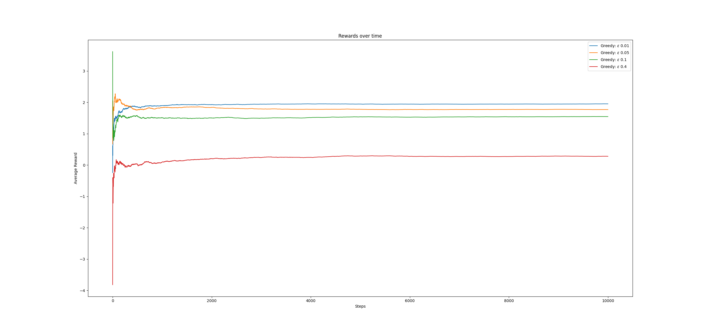
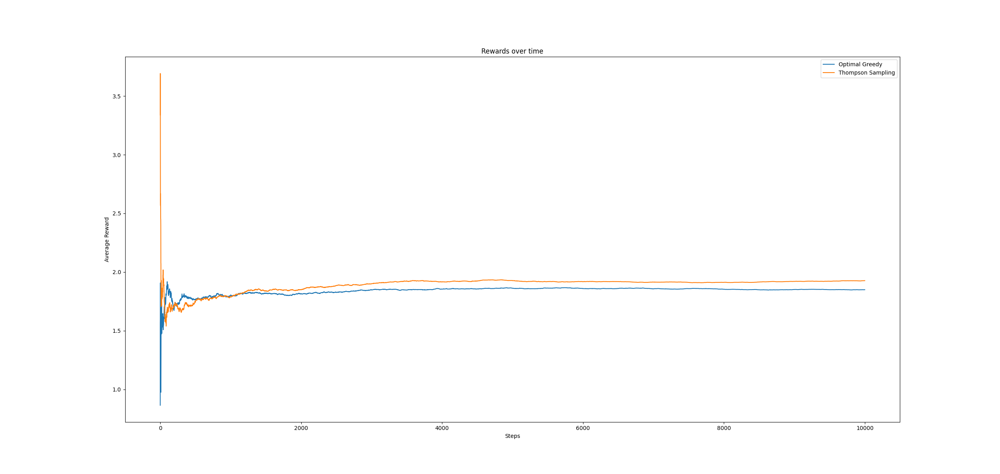
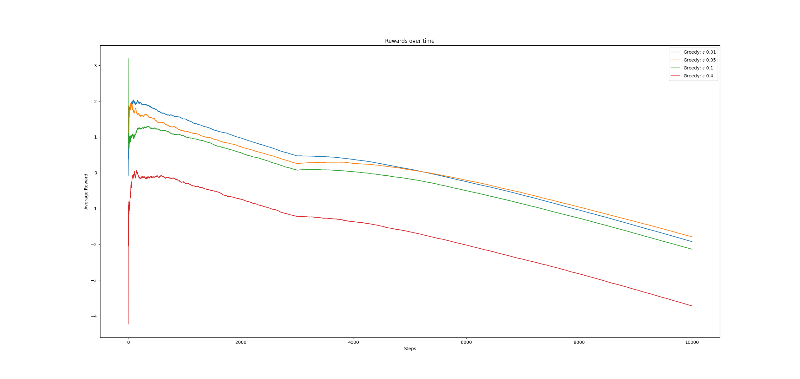

# Part 1

## Section 1
 As the image shows, a epsilon of 0.01 generally ends up performing the best overall, but 0.05 is not too far behind. As the second figure shows, all the values quickly converge after only about 1000 steps. This likely indicates that running this for 10,000 iterations is uneccesary to achieve good results as the rest of the steps have very little effect on the overall result.



Execute with
```bash
$ python Collings_Sean.py p1 epsilons
```

## Section 2
TODO

## Section 3
Execute with
```bash
$ python Collings_Sean.py p1 thompson
```

This figure demonstrates that Thompshon sampling will outperform Epsilon-greedy over time. However, intially epsilon-greedy is actually better, so you may still want to go with it depending on your dataset



# Part 2

## Section 1


## Section 2
## Section 3

## Section 4
