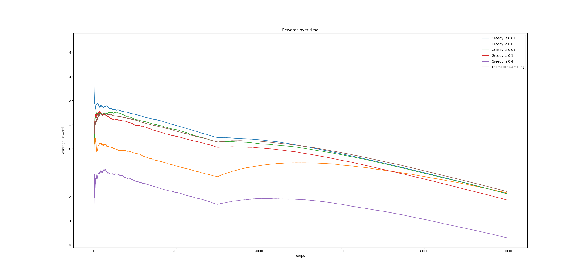

# Part 1

## Section 1
 As the image shows, a epsilon of 0.01 generally ends up performing the best overall, but 0.05 is not too far behind. As the second figure shows, all the values quickly converge after only about 1000 steps. This likely indicates that running this for 10,000 iterations is uneccesary to achieve good results as the rest of the steps have very little effect on the overall result.


Execute with
```bash
$ python Collings_Sean_HW2.py p1 epsilons
```

## Section 2
The optimal epsilon I found was 0.03. This was computed only to a percision of 2 decimal points. There may be a higher percision optimal value.

```bash
$ python Collings_Sean_HW2.py p1 optimal
```

## Section 3
Execute with
```bash
$ python Collings_Sean_HW2.py p1 thompson
```

This figure demonstrates that Thompshon sampling will outperform Epsilon-greedy over time. However, intially epsilon-greedy is actually better, so you may still want to go with it depending on your dataset. It is quickly eclipsed in this example, so that would only be the case if the dataset is small.


# Part 2

## Repeat of Part 1
As the below figure shows, introducing a negative drift causes all of the setups to tend downwards over time. The increase in several means at 3000 does produce a noticable bump in all of their trends, but is unable to counteract the effects of the negative trend overall. Obvisouly, because there is always a downward momentum to the means, the rewards never converges as it will always decrease, regardless of the number of steps. If the means stopped decreasing after a certain amount of time, the values would eventually converge.

The models display similar relationships to each other as previously. Thompson initially performs worse than some of the greedy approaches, but beging to outpace them over time. Interestingly, the optimal found in the first part intially performs much worse than some of the other options, but has the biggest improvement after 3000, and ends up just below Thompson in rewards.



## Restarting Thompson
When we restart the Thompson model, we see some interesting behavior. Intitially it has a significant dip and performs worse, but its slope is much decreased, and it quickly manages to overtake the regular Thompson. Additionally, Thompson ends up performing worse than the optimal greedy model, but the restarted Thompson model continues to be more performant than the optimal greedy up to 10,000 steps.


